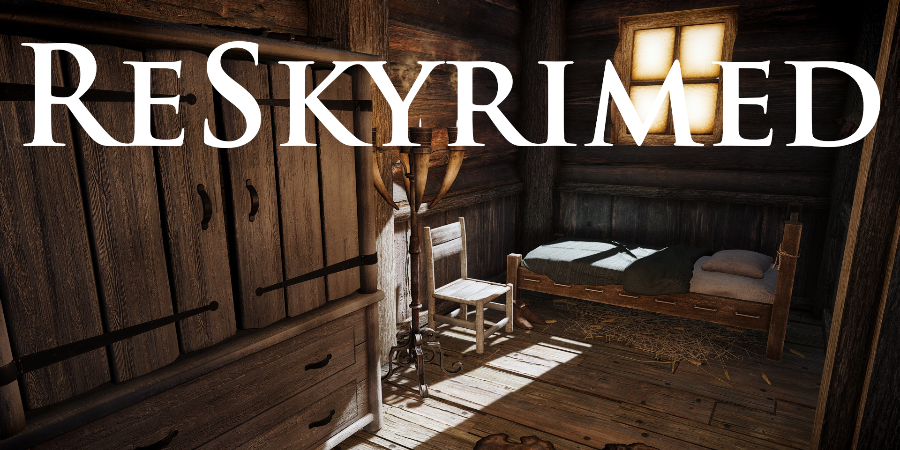

  <a href="#/">Read Me</a> |
  <a href="#/GUIDE">Gameplay Guide</a> |
  <a href="#/KEYBINDINGS">Keybindings</a> |
  <a href="#/MODIFICATION">Modification</a> |
  <a href="https://next.nexusmods.com/profile/Yuuri0?pk_vid=f0541747e7efdde9175914584554c7c2" target="_blank">Nexus</a> |
  <a href="https://discord.gg/55kHAH7T6t" target="_blank">Discord</a> |
  <a href="https://loadorderlibrary.com/lists/" target="_blank">Load Order</a>

---
## Introduction
ReSkyrimed is a Wabbajack modlist built for immersion-focused gameplay, offering a bit of everything while emphasizing small details to create a good modern RPG-like experience where I can just play Skyrim without worrying about anything else. Consistency is key, optimized for good FPS, every important location is designed to feel distinct and memorable, with its own atmosphere. Ment to be played with very little UI elements as possible.\
It draws inspiration from Skyblivion and the Oblivion Remaster to keep the world cohesive and unmistakably Skyrim.

## System Requirements
|  | Minimum | Medium | Best Experience
| :--- | :------: | :------: | :------: |
| CPU | Ryzen 5 5600 / Intel i5 12400F | Ryzen 7 5800x3D / Intel i7-12700K | Ryzen 7 9700X / Intel i7-14700K |
| GPU | RTX 3060 / RX 7600XT | RTX 4070 / RX 7800XT | RTX 5070Ti / RX 9070 |
| RAM | 16GB | 32GB | 32GB |
| Storage | 300GB SSD | 300GB M.2 SSD | 300GB NVME SSD  |
| Screen | 1920 x 1080 | 1920 x 1080 / 2560 x 1440 | 2560 x 1440 / 3840 x 2160 |

> [!NOTE]
> 8GB VRAM Cards are not supported or recommended!
> 
> Ultrawde Supported.

> [!WARNING]
> An SSD is required to the play the modlist.
> 
> Only Windows 10 or 11 operating systems are supported. 

## Pre-Installation Requirements
> [!WARNING]
> You must update Skyrim Special Edition to the latest version (1.6.1170). Anniversary Edition upgrade is required. 

### Antivirus
>[!WARNING]
>Antivirus apps sometimes mistake [MO2's Virtual File System](https://stepmodifications.org/wiki/Guide:Mod_Organizer/Advanced) for something harmful because of how it loads game files. When that happens, MO2, Skyrim, or tools launched through MO2 might not start.
>You usually don’t need to uninstall your antivirus. The fix is to add exclusions (also called “allow list” or “exceptions”) for:
> - The MO2 folder
> - Your Skyrim game folder
> - MO2’s virtual file system folder (often in `C:\ProgramData\USVFS`)
>
> After adding those, things normally work fine. Some antiviruses (like Norton, Bitdefender, AVG) can be stricter than others; if exclusions don’t help, try temporarily disabling that antivirus or uninstalling anyways. For most people, Windows Defender is pretty safe, and works plenty well with MO2.

### Pagefile and Crash Prevention
ReSkyrimed has been optimized for better memory usage, but it still demands a lot of RAM, especially if you're on a 16GB system with background tasks running. If the game can't allocate enough memory, you may experience crashes or instability.

This step isn't mandatory, but it's highly recommended if you have 16GB of RAM or less.

To set up your pagefile:
1. Press `Win + R`  
2. Type `sysdm.cpl` and press `Enter`, or use Windows Search to find `Advanced System Settings`  
3. Go to the `Advanced` tab and click the `Settings` button under the `Performance` section  
4. In the `Performance Options` window, click the `Advanced` tab and then the `Change...` button under the `Virtual Memory` section  
5. Uncheck `Automatically manage paging file size for all drives`  
6. Select your disk drive (recommended: the drive where `ReSkyrimed` is installed)  
7. Under `Custom size:`, set both `Initial size (MB)` and `Maximum size (MB)` to `40960`  
8. Click `Set`  
9. Click `OK`  
10. Restart your computer

### Installing Microsoft Visual C++ and .NET
 1. Install [Visual Studio 2015, 2017, 2019, and 2022](https://learn.microsoft.com/en-us/cpp/windows/latest-supported-vc-redist?view=msvc-170) (MO2)
 2. Install [.NET](https://dotnet.microsoft.com/en-us/download/dotnet) (Maininly .NET 9 for Synthesis & Other tools)

## Installation
Do not install Modlist or Webbajack in `C:\Program Files` or `C:\Program Files (x86)` this can cause [Windows 255 character limit issue](https://learn.microsoft.com/en-us/windows/win32/fileio/maximum-file-path-limitation?tabs=registry), and permission issues. Make sure everything is done from Root Directory.

### Nexus Download
Consider getting [Nexus](https://www.nexusmods.com) Mods Premium, it lets Wabbajack auto-download files, which makes setup much faster. Without it, you’ll be clicking every mod’s download button by hand.

### Running out of storage space
If you have less then 300GB on a SSD you tried to install ReSkyrimed on, you can always get words worst HDD or external hard drive, then tell Webbajack to put your downloads there.

### Total Download
- **Download:** `~110GB`
- **Install:**  `~140GB` - Including Stock Game Folder

### Installing Wabbajack
1. Download the [latest Wabbajack](https://www.wabbajack.org/).
2. Create a root folder, for example `C:\Wabbajack`
3. Install Wabbajack into `C:\Wabbajack`
4. Do not install to `Program Files`, OneDrive, or other protected folders.
5. Launch Wabbajack from `C:\Wabbajack`

### Steam Setup
> [!TIP]
> To prevent headaches when installling a Webbajack modlist.
>
>1) In Steam, [disable automatic updates](https://help.steampowered.com/en/faqs/view/71AB-698D-57EB-178C#disable) for Skyrim Special Edition.
>2) Ensure that your Skyrim Special Edition is installed in English.
>3) Ensure that you have installed Creation Club Files.

## Modlist Assistance & Support
>Join our [Discord](https://discord.gg/55kHAH7T6t) 

### Need help 
Send your request in `#🆘support`

### Game Crashed
Share your crash log at `#🔧share-crashlogs`

The more it crashes, the more information I can gather about the root cause.

### Game bugs and issues
Share at `#📁bug-reports` 

## FAQ
### Can I uncap the FPS?
The list is capped at 60 FPS by default. [SSE Display Tweaks](https://www.nexusmods.com/skyrimspecialedition/mods/34705) FPS is uncapped. If you wish to uncap the FPS, then you can do so by pressing `SHIFT` + `ENTER` key in-game to open ENB menu. I have purposely left uncap FPS tab open, so It should be easy to find.

### Why is there a FPS cap?
Most people would say due to the scripting engine limitations, while that is true the main reason behind fps cap is consistency in motion smoothness.

### Can't put an item into Wheeler! 
Drop and pick up the item again. Usually an issue with items that are added via a script, and not picked by the player.

### Why does 3rd Person have vanilla camera?
It’s most likely because you used the `coc` command from the main menu instead of starting a new game. Start a new game so the 3rd-person camera can initialize properly.

### I can't power attack?
Open in game MCM menu -> Click on `BFCO` -> Change `Hotkey: PowerAttack` to your desired button.

### Is this a Vanilla+ list?
No, and I don’t plan to make it so. There are many other Vanilla+ list that aim to enhance the base game experience, some of them do it very well. ReSkyrimed does not share that goal, nor does it excel as a Vanilla+ experience.

### Can I delete the downloads?
Yes, after Wabbajack finishes installing. The downside is that you can’t easily update the modlist, if a hotfix is released, you’d have to wait for Wabbajack to redownload over 1,000+ mods again.🫡

### I've modified INI settings, why are they not applying?
Check the `SKSE INI's`, `MCM Helper INI's` & `UI INI's` mod. Modify the INI files there.

### I saw ReSkyrimed uses Rootbuilder, does it copy files to Skyrim Steam Install location?
1) No, for end user Rootbuilder is basically disabled. 
2) ReSkyrimed uses Wabbajack’s Stock Game feature to copy your Steam installation of Skyrim into the ReSkyrimed install directory. This leaves your Steam copy untouched and prevents Skyrim updates from breaking the list.

### Wabbajack failed to download Curios Creation Club Content
Follow this [guide](https://wiki.wabbajack.org/user_documentation/Troubleshooting%20FAQ.html) made by Wabbajack `Unable to download 'Curios' files` & all other Wabbajack related issues.

## Things to know
### MO2 Optional Separator
This Separator is where you can pick and choose Optional Mods you would like to enable.

### MO2 Optional Separator for Ultrawide Support
Ultrawide support isn’t automatic. Enable the mods that match your ultrawide display’s aspect ratio or resolution.

## Conclusion
ReSkyrimed is a deliberately distinctive modlist that follows a single-author vision, and the choices it makes set it apart from most lists. It doesn’t chase a catchphrase; the aim is a cohesive experience that still feels like Skyrim. It isn’t a Vanilla+ list, almost every aspect has been touched or changed, yet the result remains familiar and playable.

## Credits & Thanks
### I wouldn't even consider making the modlist with out this talented Authors:
[jkrojmal](https://next.nexusmods.com/profile/jkrojmal?gameId=1704)\
[gutmaw](https://next.nexusmods.com/profile/gutmaw?gameId=1704)\
[Ryn2g](https://next.nexusmods.com/profile/Ryn2g?gameId=1704)\
[snozz2004](https://www.nexusmods.com/skyrimspecialedition/mods/111465)\
[TheOneTrueFuzzBeed](https://next.nexusmods.com/profile/TheOneTrueFuzzBeed?gameId=1704)\
[RubberSpaghetti](https://next.nexusmods.com/profile/RubberSpaghetti?gameId=1704)

### Special thanks to:
[riverbord](https://next.nexusmods.com/profile/riverbord?gameId=1704) Giving a lot of assistance! Early days of modding!\
[ra2phoenix](https://next.nexusmods.com/profile/ra2phoenix?gameId=1704) Giving a lot of assistance! Check out [Skyrim Unification Project ](https://skyrimunificationproject.github.io/) Basiclly ReSkyrimed on Steroids!\
[GGUNIT](https://next.nexusmods.com/profile/GGUNIT?gameId=1704) Assistance with Lux issues & hot fixes.\
[JPSteel2](https://www.nexusmods.com/skyrimspecialedition/mods/775304) Assistance with Northern Roads issues.\
[W1ter](https://next.nexusmods.com/profile/W1terr) Feedback and Assistance.\
[demi](https://www.youtube.com/watch?v=xvFZjo5PgG0) UI help and Assistance.

#### And all the Testers from ReSkyrimed Guild Discord Server!     